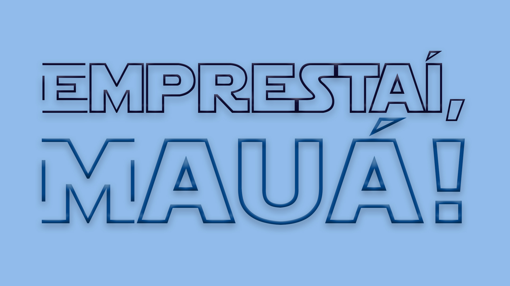

# Emprestaí, Mauá!

> O "Emprestaí, Mauá!" é um sistema que facilita o empréstimo de equipamentos, desenvolvido exclusivamente para o Instituto Mauá de Tecnologia. O sistema permite obter maior controle sobre os empréstimos realizados, além de agilizar o processo por meio de um aplicativo auxiliar. 

## 💻 Site oficial

<a href="http://www.emprestaimaua.com.br">emprestaimaua.com.br</a>

## 🤝 Colaboradores

Agradecemos às seguintes pessoas que contribuíram para este projeto:

<table>
  <tr>
    <td align="center">
      <a href="https://github.com/Enrico-Saez">
         
        
          <b>Enrico Saez</b>
        
      </a>
    </td>
    <td align="center">
      <a href="https://github.com/dhuzika">
         
        
          <b>Eduardo Villela</b>
        
      </a>
    </td>
    <td align="center">
      <a href="https://github.com/luigicattaruzzi">
         
        
          <b>Luigi Cattaruzzi</b>
        
      </a>
    </td>
    <td align="enter">
      <a href="https://github.com/Felpsnm">
         
        
          <b>Felipe Nelli</b>
        
      </a>
    </td>
  </tr>
</table>

## 📝 Licença

Esse projeto está sob licença. Veja o arquivo [LICENÇA](LICENSE.md) para mais detalhes.

[⬆ Voltar ao topo](#nome-do-projeto) 